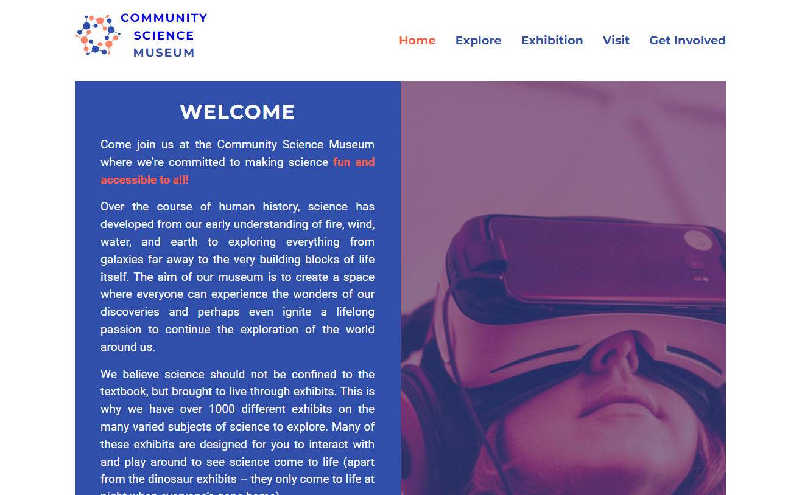

# Community Science Museum



Community Science Museum is a fictional science museum website that aims to appeal to kids and families with young children. The website is designed to be colorful, engaging, and modern, reflecting the exciting world of science. This website is a school project created for the Front-End Development course at Noroff School of Technology and Digital Media.

## Description

The Community Science Museum website is intended to serve as an information portal for a fictional science museum. With its focus on a younger audience, the design is vibrant, modern, and engaging, capturing the essence of curiosity and learning. The website is created using pure HTML and CSS, and the design was crafted using Figma. Canva was employed for logo creation. The project aims to not only provide information about the museum's exhibits but also create an immersive and educational experience that inspires interest in science among kids and families.

### Key Features

- Modern, Colorful and Engaging Design: The website is designed to resonate with children and families by adopting a modern, colorful, and engaging aesthetic.

- Exhibit Sections: Informative sections that provide details on various science exhibits.

- Educational Resources: The website offers educational resources to enhance the learning experience.

- Event Calendar: A calendar to keep visitors informed about upcoming events and programs at the museum.

- Contact Information and Location: Easily accessible contact information and location details for the museum.

## Built With

- HTML
- CSS
- Figma (for design)
- Canva (for creating the logo)

## Getting Started

### Installing

1. Clone the repo:

```bash
git clone git@github.com:jomolteberg/semester-project-1.git
```

2. Install the dependencies:

```
npm install
```

### Running

To run the app, run the following commands:

```bash
npm run start
```

## Contributing

Contributions are welcome! If you would like to contribute, please fork the repository and make changes as you'd like. Push your changes to your fork and submit a pull request. Please make sure to review your code before submitting.

## Contact

Feel free to contact me:

[LinkedIn](https://www.linkedin.com/in/john-oscar-molteberg-637177180/)
